# Lab 1 – GPO Management & Deployment  
Help Desk / IT Admin Portfolio Lab

This lab demonstrates core Windows Server administration skills using Group Policy Objects (GPOs).  
It includes password policy configuration, desktop restrictions, login scripts, mapped drives, and security hardening settings.  
All GPOs were created and applied in a Windows Server Active Directory environment, then verified on a domain-joined workstation.

---

## **1. Password Policy GPO**

Created **GPO1 – Password Policy** and configured domain password requirements:

- Enforce password history: 10  
- Maximum password age: 30 days  
- Minimum password age: 1 day  
- Minimum password length: 12 characters  
- Password must meet complexity requirements: Enabled  
- Store passwords using reversible encryption: Disabled  

### **Screenshot**
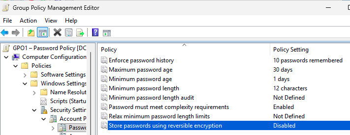

---

## **2. Desktop Restrictions GPO**

Created **GPO2 – Desktop Restrictions** to lock down user interface options.

### **Restrictions Applied**
- Hide Control Panel  
- Hide all desktop items  
- Prevent changing desktop background  
- Remove Run menu  
- Prevent changes to Taskbar and Start Menu  

### **Screenshots**
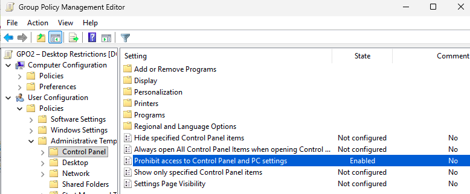

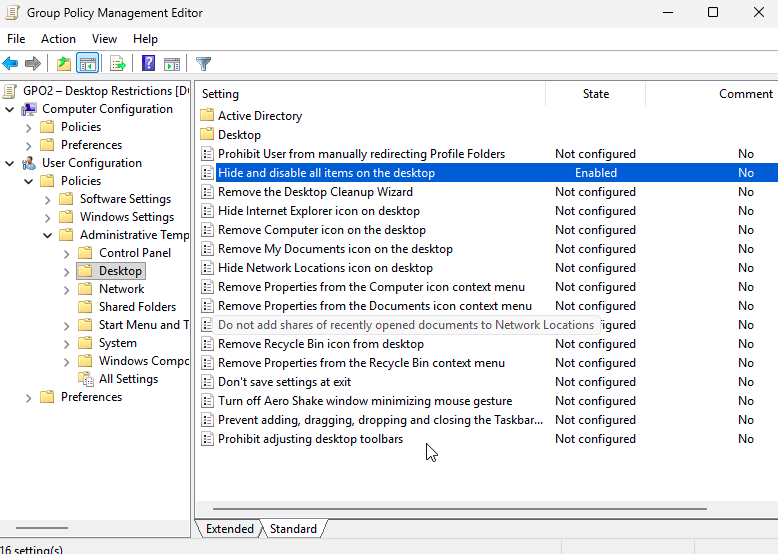

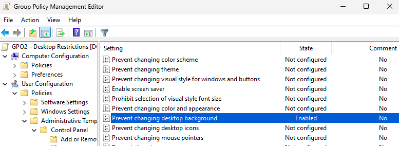

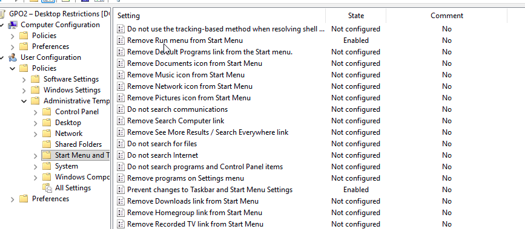

---

## **3. Login Script GPO (Drive Mapping)**

Created **GPO3 – Login Script**, placed a batch file in SYSVOL, and configured it to run at logon.

### **Script**
net use H: \DC01\Share /persistent:yes

### **Screenshots**
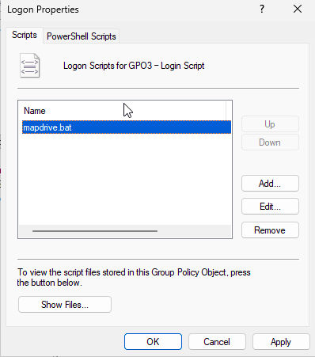

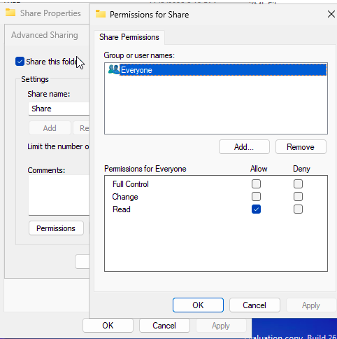

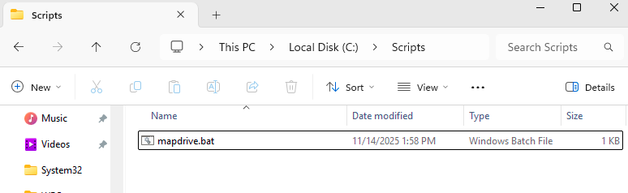

---

## **4. Security Hardening GPO**

Created **GPO4 – Security Hardening** to apply recommended baseline configurations.

### **Account Policies**
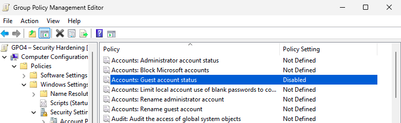

### **CTRL+ALT+DEL Requirement**
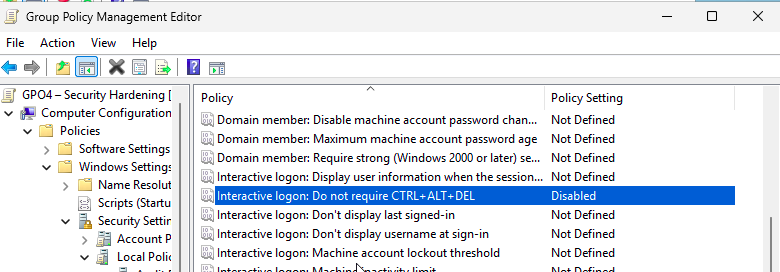

### **UAC Hardening**
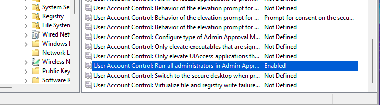

### **SMB Hardening**
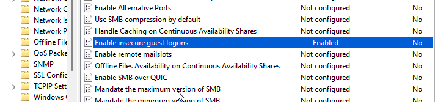

### **Firewall Node Verification**
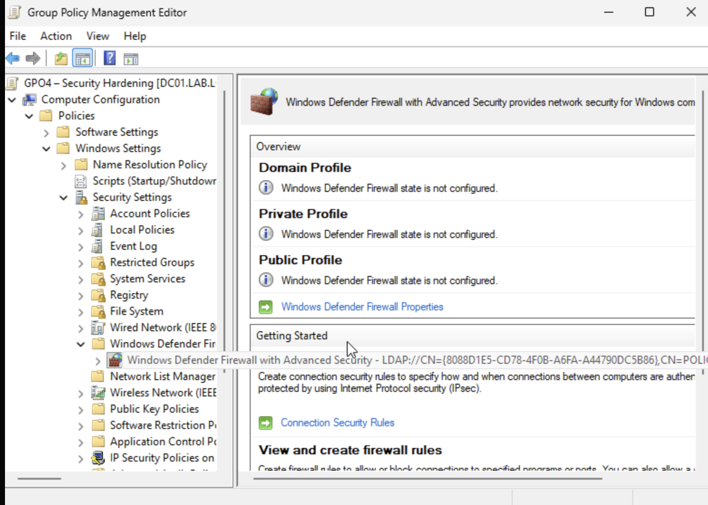

---

## **5. Verification on WORKSTATION01**

### **Policy Update**
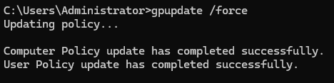

### **GPO Application Report**
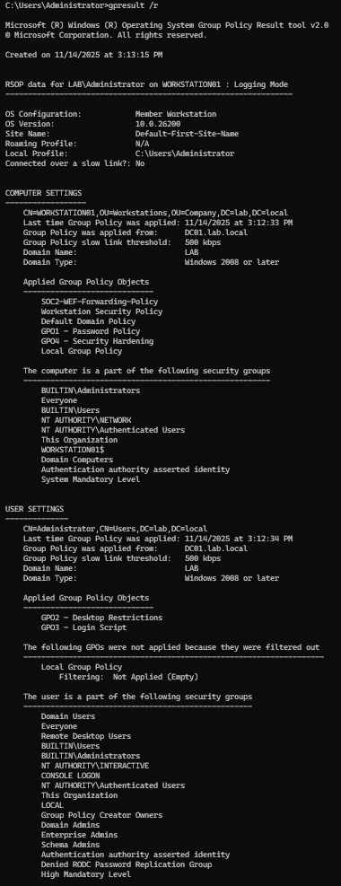

### **Drive Mapping Success**
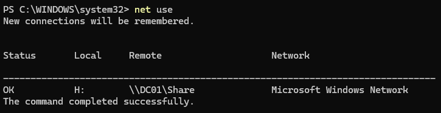

---

## **Conclusion**

This lab demonstrates the ability to:

- Create and manage GPOs  
- Configure password and security policies  
- Apply user interface restrictions  
- Deploy login scripts via SYSVOL  
- Map network drives automatically  
- Perform AD workstation hardening  
- Verify Group Policy application with gpupdate and gpresult  

These are core skills for Help Desk, IT Support, Junior SysAdmin, and SOC Analyst roles.

---