# IT Admin Lab 2 — DNS Server Configuration

## Overview
In this lab, I configured Domain Name System (DNS) services on a Windows Server Domain Controller (DC01) and validated name resolution from a domain-joined workstation (Workstation01). The lab covered forward lookup zones, reverse lookup zones, host (A) records, CNAME records, PTR records, conditional forwarders, and DNS troubleshooting.

## Objectives
- Access DNS Manager and verify DNS functionality
- Create and verify A, CNAME, and PTR records
- Configure a reverse lookup zone
- Add a conditional forwarder
- Test DNS resolution from a Windows workstation
- Troubleshoot failed name resolution and validate repair

## Lab Topology

| Device | Role | Hostname | IP Address | OS |
|--------|------|-----------|------------|----|
| Domain Controller | AD DS + DNS | DC01 | 192.168.64.4 | Windows Server |
| Workstation | Domain Client | Workstation01 | 192.168.64.2 | Windows 11 |

Domain FQDN: lab.local

---

## Configuration Steps and Evidence

### Step 1 — Open DNS Manager
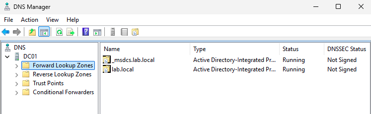

### Step 2 — Forward Lookup Zones
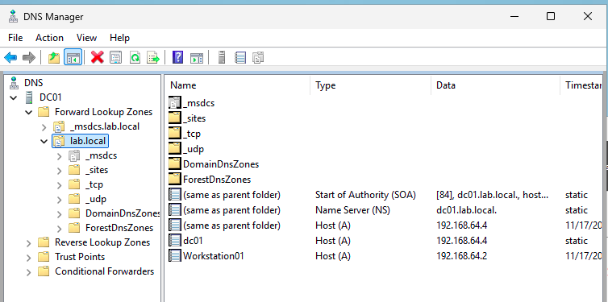

### Step 3 — DC01 A Record Properties
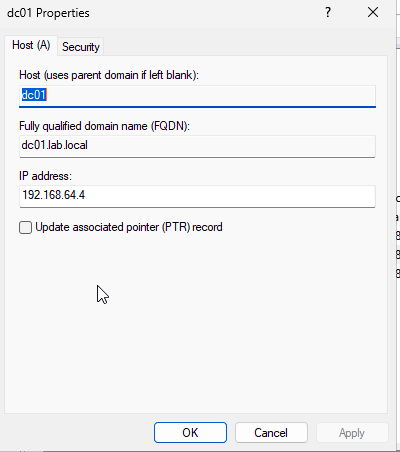

### Step 4 — Create A Record for Web01
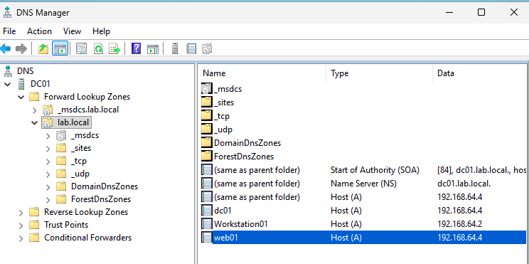

### Step 5 — Forward Zone Records
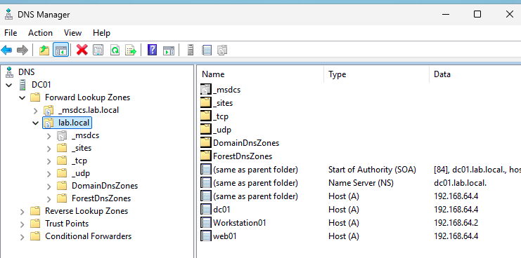

### Step 6 — Create CNAME (www → web01)
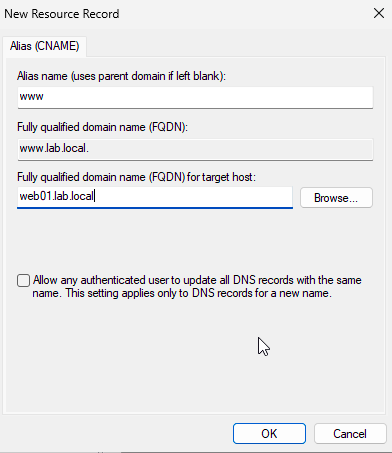

### Step 7 — CNAME Record Listed
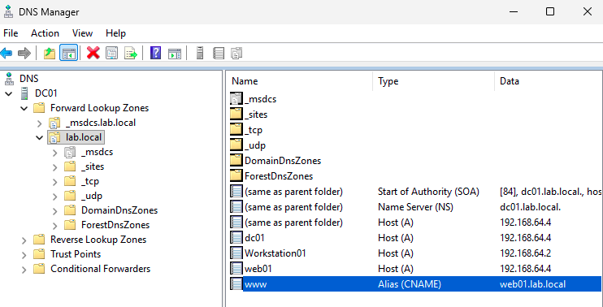

### Step 8 — Create Reverse Lookup Zone
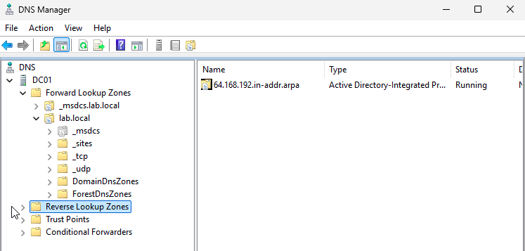

### Step 9 — Create PTR Record
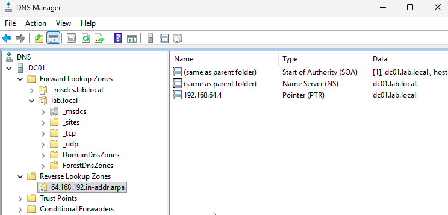

### Step 10 — PTR Records Listed
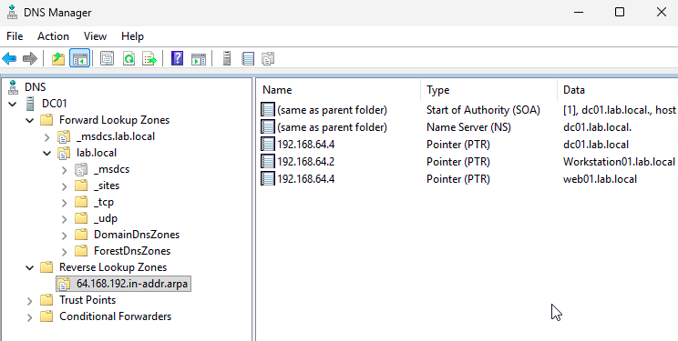

### Step 11 — Create Conditional Forwarder
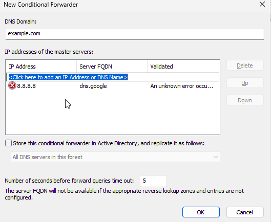

### Step 12 — Conditional Forwarder Listing
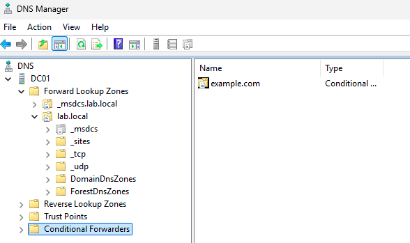

---

## Client-Side Testing

### Step 13 — View DNS Configuration

### Step 14 — Initial DNS Lookup Tests (Issue Identified)

### Step 15 — Final DNS Resolution Successful
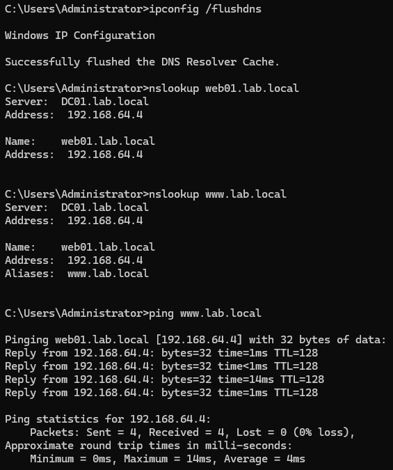

---

## Troubleshooting Summary

| Issue | Root Cause | Resolution |
|--------|------------|-------------|
| web01 failed to resolve | Corrupted/duplicate A + PTR record | Deleted record using dnscmd and recreated clean |
| DNS server name showed incorrectly | PTR conflict | Removed incorrect PTR entry |
| Inconsistent lookup results | Cached stale data | Flushed client and server cache |

Commands used:
ipconfig /flushdns
ipconfig /registerdns
dnscmd /recorddelete lab.local web01 A /f
Clear-DnsServerCache -Force

---

## What I Learned
- How forward and reverse lookup zones work together
- The relationship between A, CNAME, and PTR records
- How conditional forwarders are used for external DNS resolution
- nslookup as a diagnostic tool for DNS
- How cached DNS responses can cause misleading results
- How to correct DNS record corruption in AD-integrated zones

---

## Next Lab
IT Admin Lab 3 — Group Policy (GPO) Configuration and Deployment