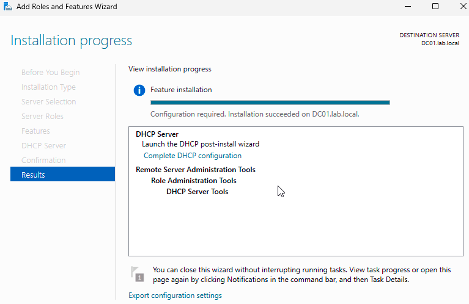
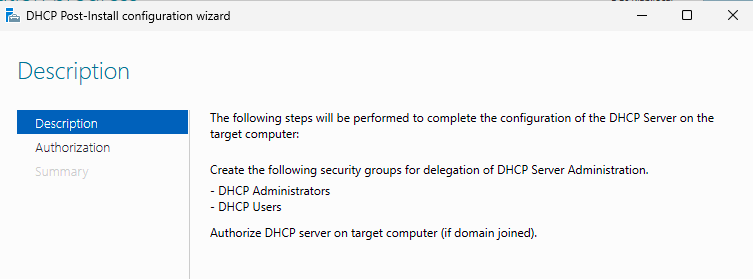
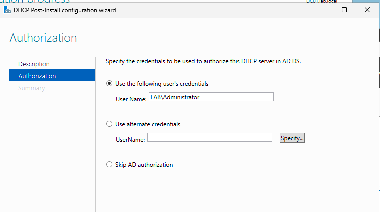
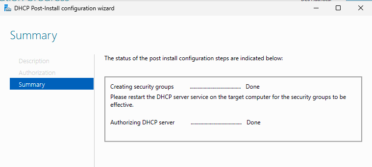
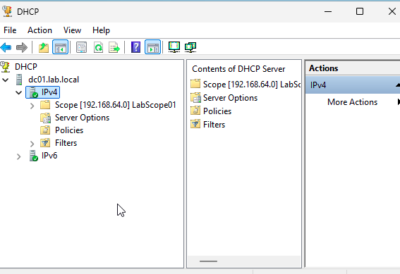
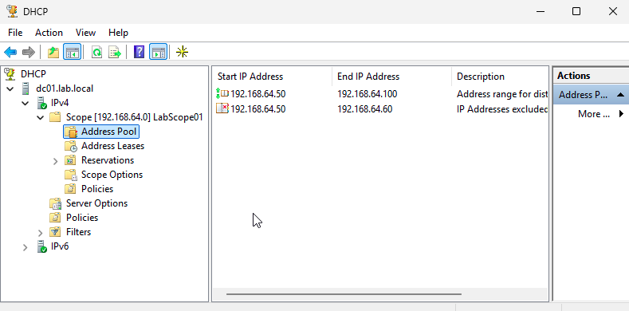
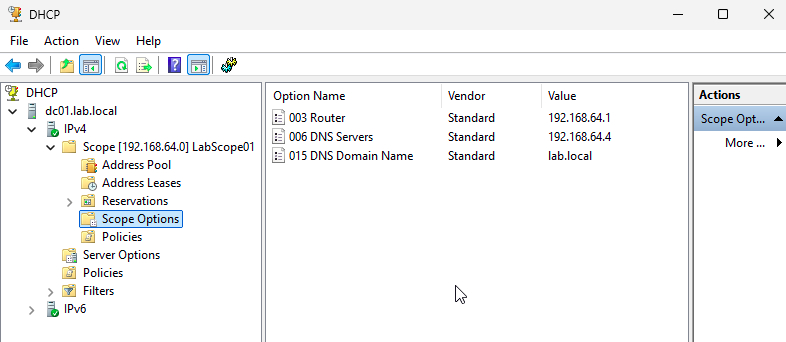
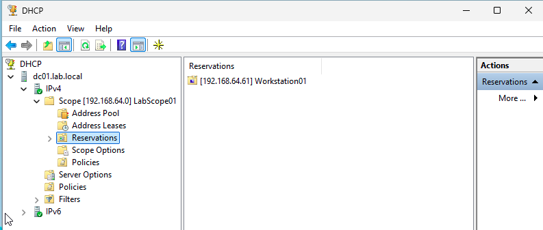
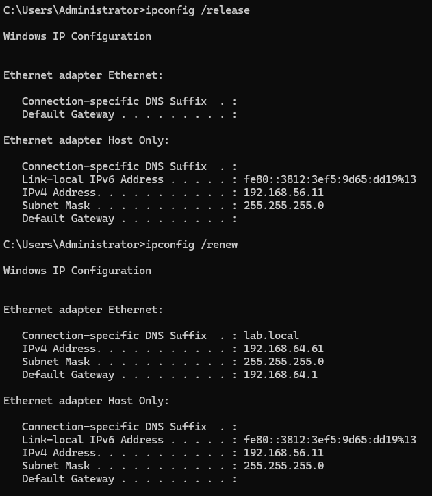
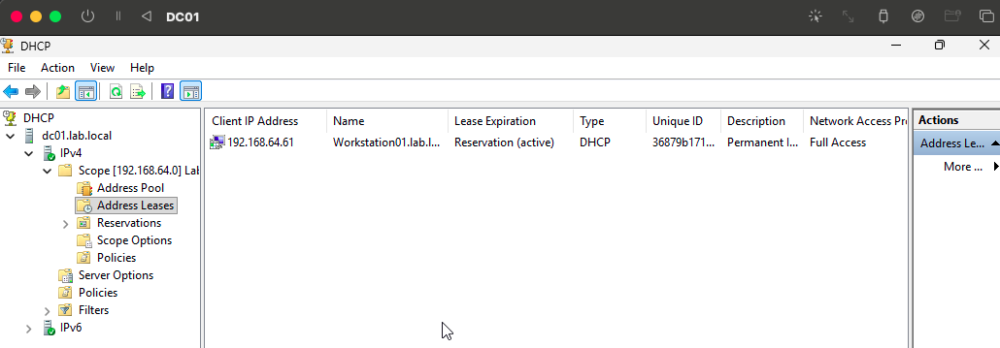

# DHCP Server Configuration Lab (DC01 + Workstation01)

## Overview
This lab demonstrates how to install, configure, and validate a functioning DHCP server in a Windows Server domain environment. DHCP was deployed on **DC01**, and **Workstation01** was used to test DHCP lease assignment and reservation functionality.

This lab includes:
- Installing the DHCP Server role  
- Completing DHCP post-install configuration  
- Creating a DHCP scope  
- Adding exclusion ranges  
- Configuring scope options  
- Creating reservations  
- Testing DHCP client lease pull  
- Verifying active leases on the server  

---

## Folder Structure

```
lab3-dhcp-setup/
│
├── README.md
└── screenshots/
    ├── dhcp01-dc01-role-installed.png
    ├── dhcp02-dc01-post-install-wizard.png
    ├── dhcp03-dc01-authorization.png
    ├── dhcp04-dc01-authorization-complete.png
    ├── dhcp05-dc01-scope-created.png
    ├── dhcp06-dc01-exclusion-range.png
    ├── dhcp07-dc01-scope-options.png
    ├── dhcp08-dc01-reservation-created.png
    ├── dhcp09-workstation01-dhcp-lease.png
    └── dhcp10-dc01-address-lease.png
```

---

## Step 1 — Install DHCP Server Role



---

## Step 2 — Complete DHCP Post-Install Configuration







---

## Step 3 — Create DHCP Scope

Scope details:

- Start IP: **192.168.64.50**  
- End IP: **192.168.64.100**  
- Subnet mask: **255.255.255.0**  
- Scope Name: **LabScope01**



---

## Step 4 — Add Exclusion Range

Exclusion range added:

- **192.168.64.50 → 192.168.64.60**



---

## Step 5 — Configure Scope Options

Configured DHCP options:

- **003 Router:** 192.168.64.1  
- **006 DNS Server:** 192.168.64.4  
- **015 DNS Domain Name:** lab.local  



---

## Step 6 — Create DHCP Reservation

Created a reservation for **Workstation01**:

- Reserved IP: **192.168.64.61**  
- MAC Address: **36-87-9B-17-1D-5B**  



---

## Step 7 — Workstation01 Receives DHCP Lease

After running:

```
ipconfig /release
ipconfig /renew
```

Workstation01 successfully received:

- IP Address: **192.168.64.61**  
- DNS: **192.168.64.4**  
- Gateway: **192.168.64.1**



---

## Step 8 — Verify Lease on DC01

The reservation appears under Address Leases on DC01.



---

## Lab Complete

This completes the DHCP server setup and validation process. DC01 is fully configured to distribute IP addresses, enforce scope options, and maintain reservations within the lab environment.
