# IT Admin Lab 4 – Departmental File Share & NTFS Permissions

This lab covers creating AD security groups, assigning users, building a shared folder structure on DC01, configuring NTFS + Share permissions, and validating access from WORKSTATION01.

---

## 1. Create Department Security Groups (DC01)

### 1.1 Create HR-SG  
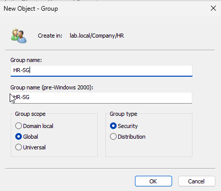

### 1.2 Create Finance-SG  
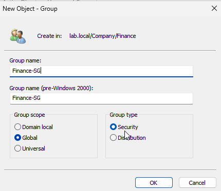

### 1.3 Create IT-SG  
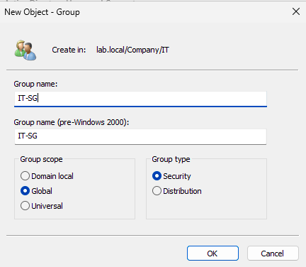

### 1.4 Create Public-SG  
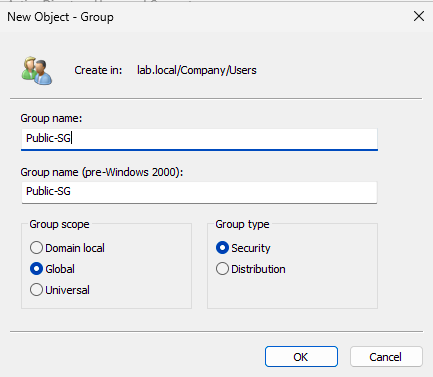

---

## 2. Add Users to Their Department Groups (DC01)

### 2.1 Add HR user to HR-SG  
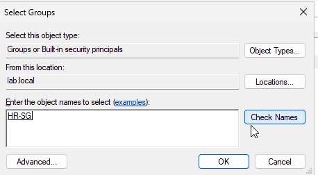

### 2.2 Add Finance user to Finance-SG  
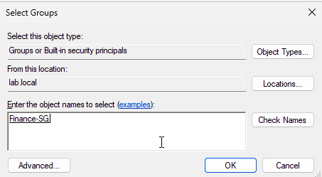

### 2.3 Add IT user to IT-SG  
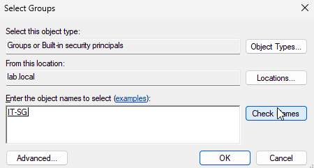

### 2.4 Add users to Public-SG  
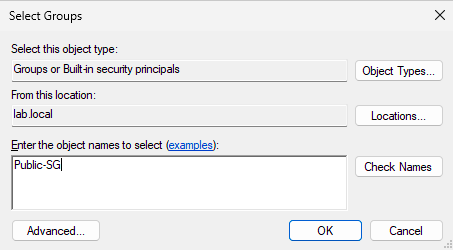

---

## 3. Create Department Shared Folders (DC01)

### 3.1 Create the root `CompanyShares` folder  
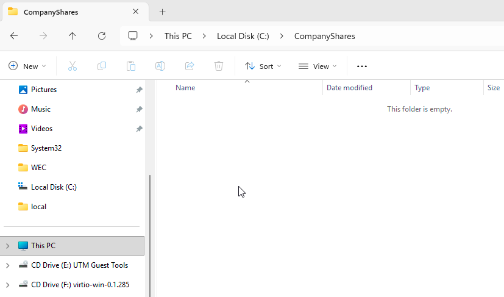

### 3.2 Create subfolders: HR, Finance, IT, Public  
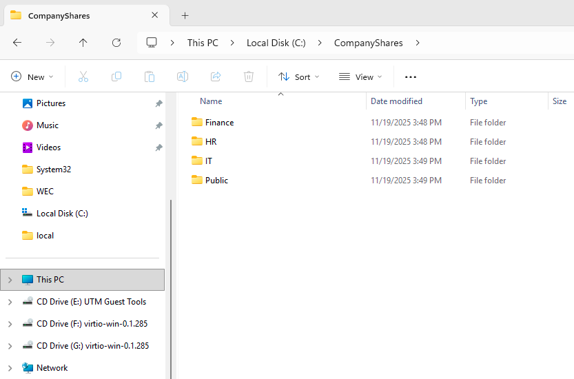

---

## 4. Configure NTFS Permissions (DC01)

> Goal: Each department folder grants Modify to its department security group, with Administrators and SYSTEM retaining Full Control.

### 4.1 HR folder NTFS permissions  
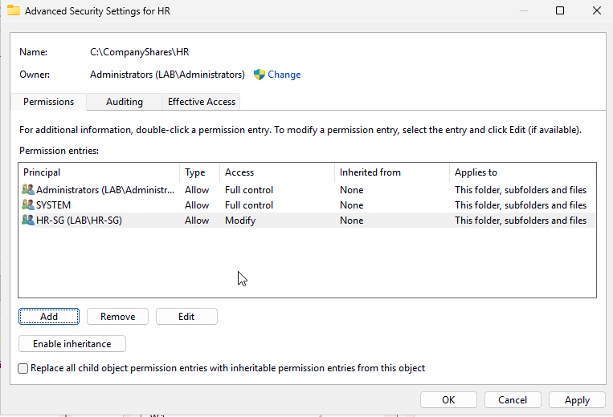

### 4.2 Finance folder NTFS permissions  
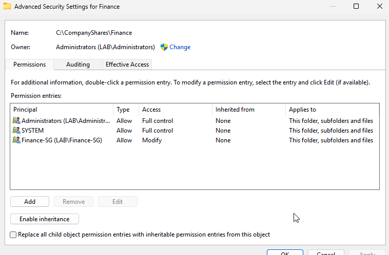

### 4.3 IT folder NTFS permissions  
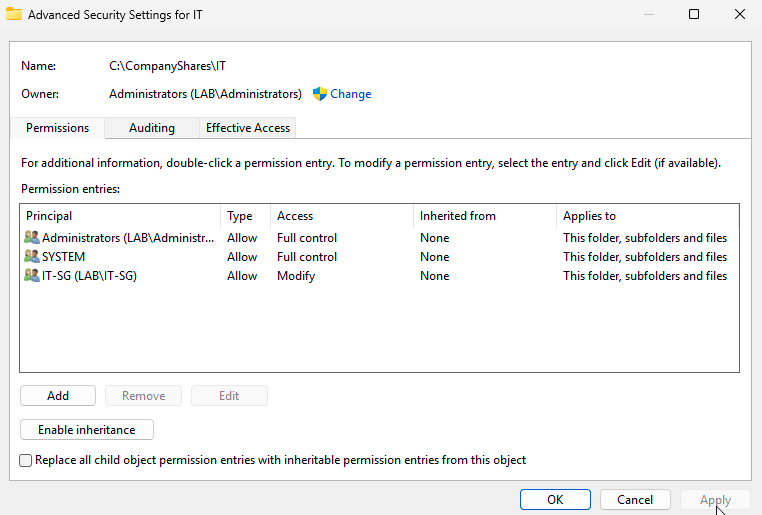

### 4.4 Public folder NTFS permissions  
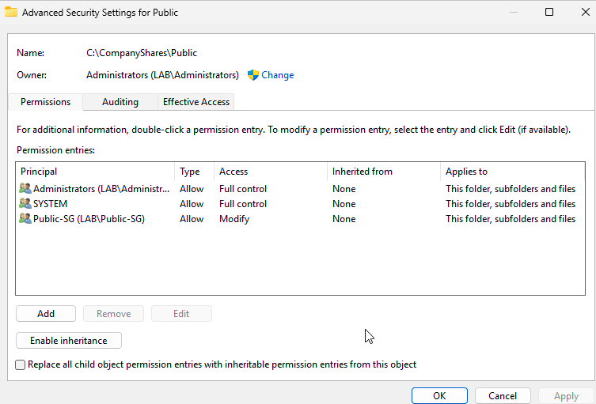

---

## 5. Configure Share Permissions (DC01)

> Goal: Share each folder with a hidden share name (ending in `$`) and appropriate access for each department group.

### 5.1 HR share permissions (HR$)  
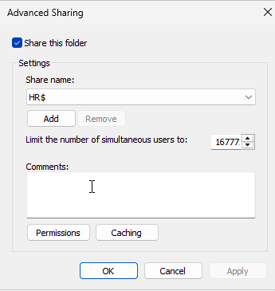

### 5.2 Finance share permissions (Finance$)  
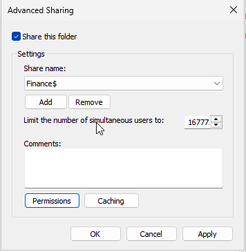

### 5.3 IT share permissions (IT$)  
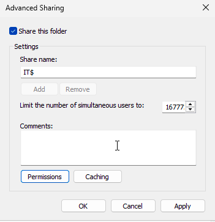

### 5.4 Public share permissions (Public)  
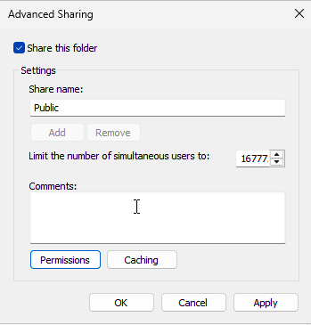

---

## 6. Validate Access from WORKSTATION01

Log onto WORKSTATION01 with different domain users and test each UNC path to confirm that only the correct department can access its folder.

### 6.1 Finance user → `\\DC01\Finance$`  
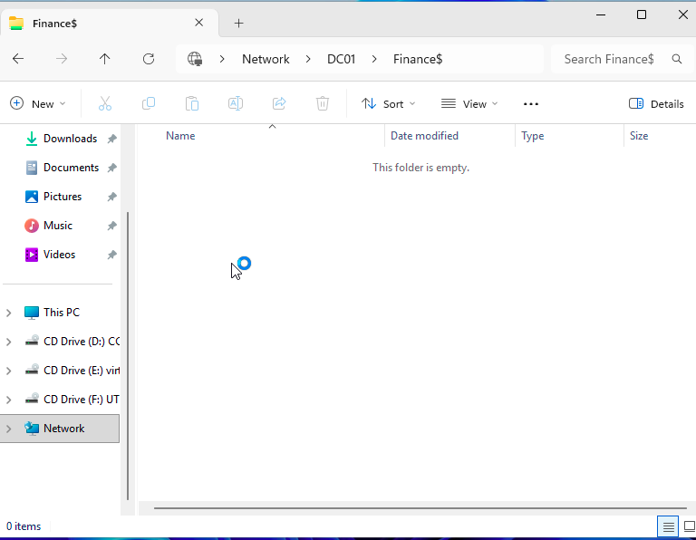

### 6.2 HR user (Emily Perez) → `\\DC01\HR$`  
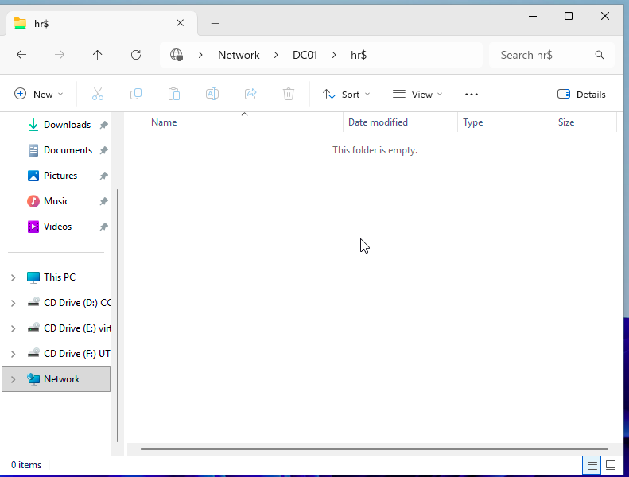

### 6.3 IT user → `\\DC01\IT$`  
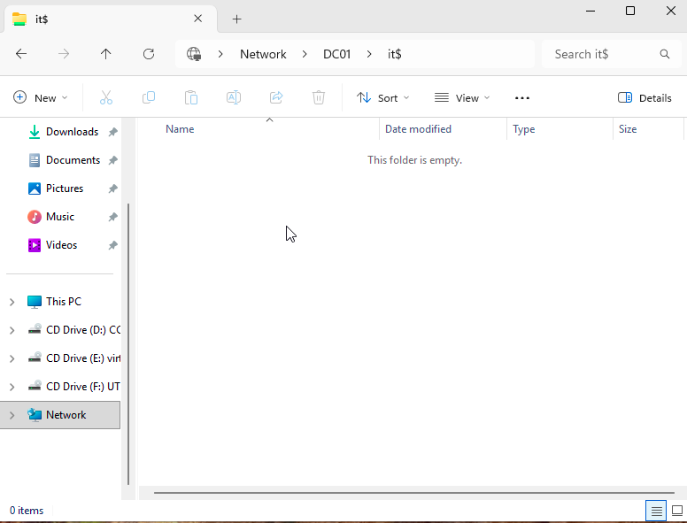

### 6.4 HR user denied access to `\\DC01\Public`  
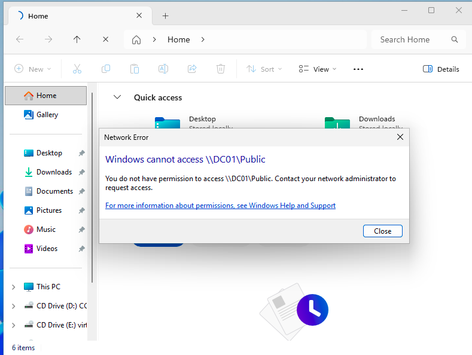

---

## 7. Summary

- Department security groups (HR-SG, Finance-SG, IT-SG, Public-SG) were created in Active Directory.
- Users were added to the correct groups based on their department.
- A central `C:\CompanyShares` structure was created with separate HR, Finance, IT, and Public folders.
- NTFS and Share permissions were configured so each department only has access to its own share.
- Access tests from WORKSTATION01 confirmed:
  - HR users can access `\\DC01\HR$`.
  - Finance users can access `\\DC01\Finance$`.
  - IT users can access `\\DC01\IT$`.
  - Access to Public from Emily (HR) is denied in this lab configuration, which matches the intended permissions.

