# Lab 5 – AGDLP Security Groups

## Objective
Implement Microsoft's AGDLP permissions model using Global Groups (GG), Domain Local Groups (DL), and NTFS permissions to control access to shared departmental folders.

AGDLP = **Accounts → Global → Domain Local → Permissions**

---

## Step 1 — Create Department Folders
On **DC01**, create:

```
C:\Shares\HR
C:\Shares\IT
```

**Screenshot:**  
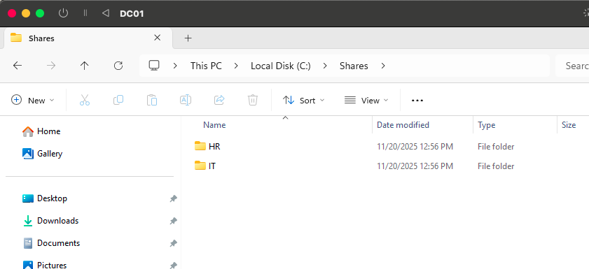

---

## Step 2 — Create Global Groups (G)
In **Company → Groups**, create these GLOBAL SECURITY groups:

- HR-GG  
- IT-GG  

**Screenshot:**  
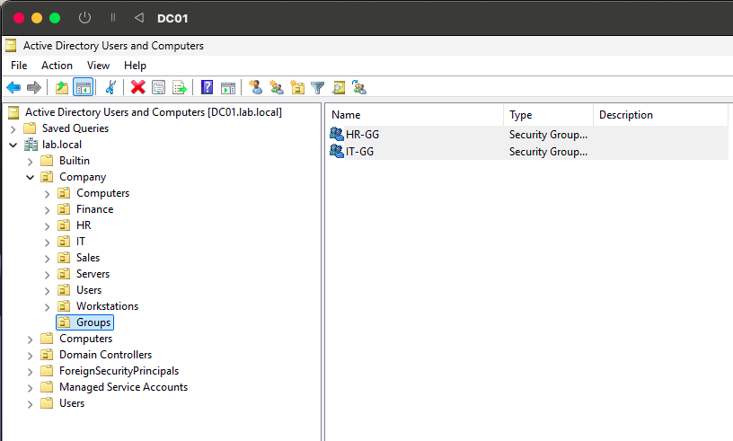

---

## Step 3 — Create Domain Local Groups (DL)
In the same OU, create these DOMAIN LOCAL SECURITY groups:

**HR:**
- HR-DL-Read
- HR-DL-Modify

**IT:**
- IT-DL-Read
- IT-DL-Modify

**Screenshot:**  
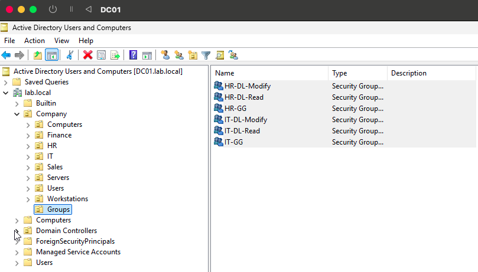

---

## Step 4 — Create Test Users (A = Accounts)
Create:

**HR user:** Amanda HR  
**IT user:** Ivan IT  

**Screenshots:**  
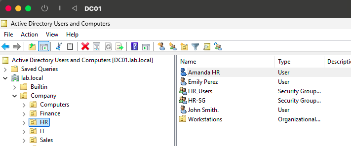  
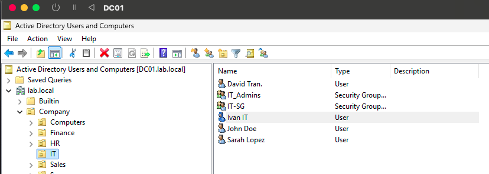

---

## Step 5 — Add Users to Global Groups (A → G)
- Add *Amanda HR* → **HR-GG**  
- Add *Ivan IT* → **IT-GG**

**Screenshots:**  
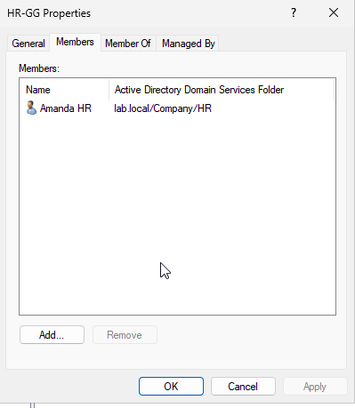  
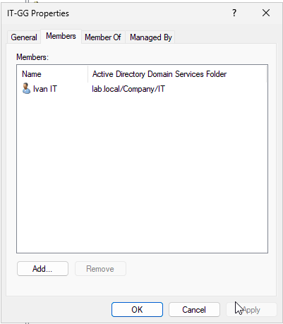

---

## Step 6 — Nest Global Groups into Domain Local Groups (G → DL)

### HR
- HR-GG → HR-DL-Read  
- HR-GG → HR-DL-Modify  

### IT
- IT-GG → IT-DL-Read  
- IT-GG → IT-DL-Modify  

**Screenshots:**  
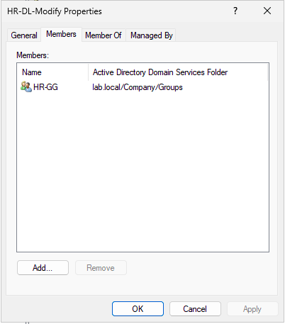  
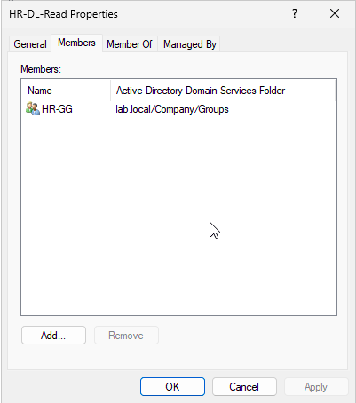  
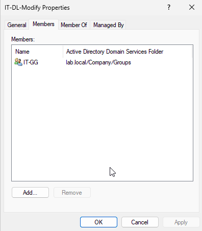  
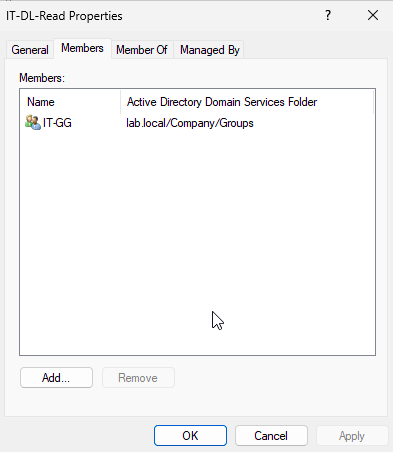

---

## Step 7 — Configure NTFS Permissions (DL → P)

### HR Folder NTFS Permissions
- HR-DL-Modify → Modify  
- HR-DL-Read → Read  

**Screenshot:**  
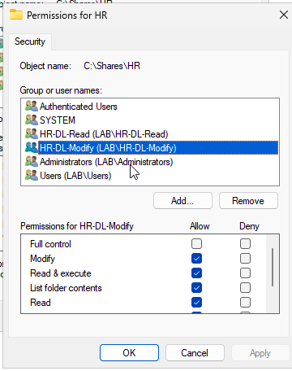

---

### IT Folder NTFS Permissions
- IT-DL-Modify → Modify  
- IT-DL-Read → Read  

**Screenshot:**  
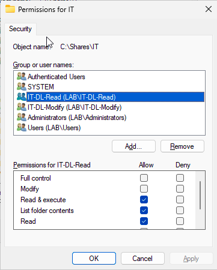

---

## Step 8 — Share the `C:\Shares` Folder
Share name: **Shares**

Share permissions:
- Everyone → Full Control

**Screenshot:**  


---

## Step 9 — Test Access from Workstation01

### HR User: Amanda HR
Tests:
- Should be able to create/modify in **HR**
- Should be denied access to **IT**

**Screenshot:**  
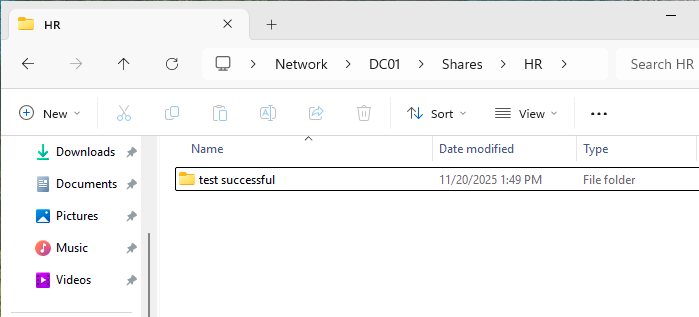

---

### IT User: Ivan IT
Tests:
- Should be able to create/modify in **IT**
- Should be denied access to **HR**

**Screenshot:**  
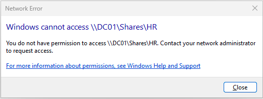

---

## Conclusion
This lab successfully demonstrates Microsoft’s AGDLP model:

**Accounts → Global Groups → Domain Local Groups → Permissions**

- Department access is controlled cleanly  
- No direct user assignments  
- Easily scalable for enterprise environments  
