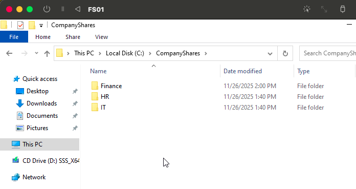
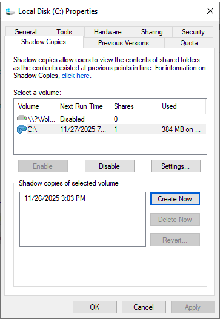
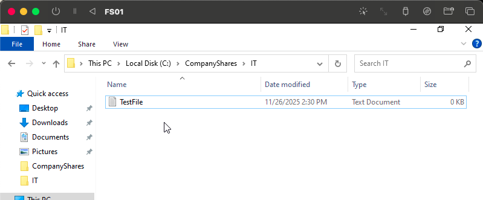
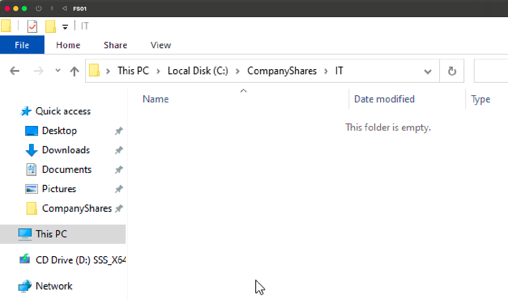
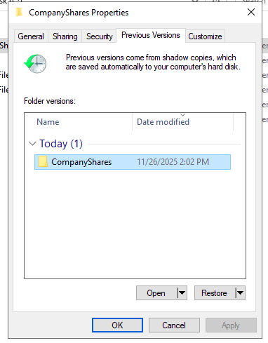
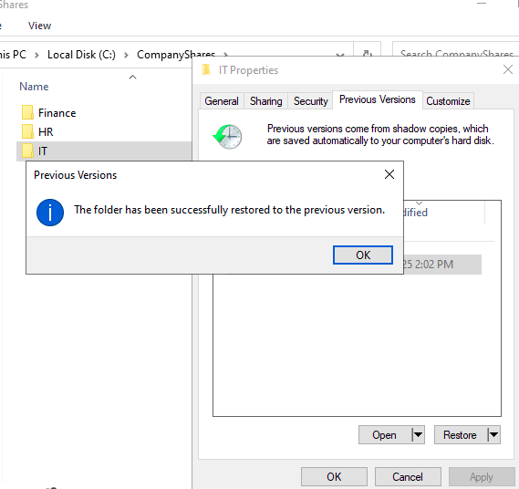
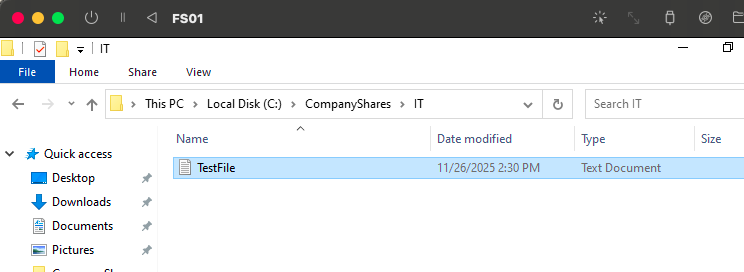

# 🗂️ Lab 6 — Shadow Copies & File Restore

This lab demonstrates how to enable Shadow Copies on FS01, delete a file in a shared folder, and restore it using the Previous Versions feature in Windows Server.

---

## 🎯 **Lab Objectives**

By the end of this lab, you will be able to:

- Understand the purpose of **Shadow Copies** in Windows Server  
- Enable Shadow Copies on a volume  
- Create a file inside a shared folder used by domain users  
- Delete a file and simulate real-world accidental deletion  
- Restore files using **Previous Versions**  
- Verify file restoration in a shared folder

---

# ✅ **Step 1 — Verify Folder Structure**

On **FS01**, open File Explorer and navigate to:

C:\CompanyShares

Confirm the subfolders **Finance**, **HR**, and **IT** exist.

**Screenshot:**  

---

# ✅ **Step 2 — Enable Shadow Copies**

1. Right-click **Local Disk (C:)** → **Properties**  
2. Go to the **Shadow Copies** tab  
3. Select **C:\\**  
4. Click **Enable**  
5. Optionally configure:
   - Storage size  
   - Snapshot schedule  

**Screenshot:**  

---

# ✅ **Step 3 — Create Test File**

Navigate to:

C:\CompanyShares\IT

Create a new file named:

TestFile.txt

**Screenshot:**  

---

# ✅ **Step 4 — Delete the Test File**

Delete **TestFile.txt** from the IT folder.

**Screenshot:**  

---

# ✅ **Step 5 — Open Previous Versions**

1. Right-click **IT folder** → **Properties**  
2. Go to the **Previous Versions** tab  
3. Select a shadow copy taken *before* deletion  

**Screenshot:**  

---

# ✅ **Step 6 — Restore the Folder**

Click **Restore** and confirm.

**Screenshot:**  

---

# ✅ **Step 7 — Verify Restoration**

Return to:

C:\CompanyShares\IT

Confirm **TestFile.txt** has been restored successfully.

**Screenshot:**  

---

# 📌 **Summary / Lessons Learned**

This lab demonstrated a realistic scenario where a user accidentally deletes an important file from a shared folder. Shadow Copies provide:

### ✔ Fast file recovery without needing a full backup  
### ✔ End-user self-service via Previous Versions  
### ✔ Protection against accidental deletion or overwriting  
### ✔ Low-storage, low-maintenance snapshots  
### ✔ A critical feature in enterprise file servers  

---

