# Lab 7 – Backup & Recovery Basics  
**Windows Server 2022 | DC01**

This lab demonstrates how to install Windows Server Backup, configure full and incremental backups, simulate data loss, and perform file recovery on DC01.

---

## 📌 Objectives
- Install and enable **Windows Server Backup**
- Create a **dedicated virtual disk** for backups
- Run a **Full Server backup**
- Create test data and perform an **incremental backup**
- Simulate data loss
- Use the **Recovery Wizard** to restore deleted files
- Validate recovery results

---

## 📂 Screenshots  
All screenshots are stored in the `screenshots/` folder.

### Installation
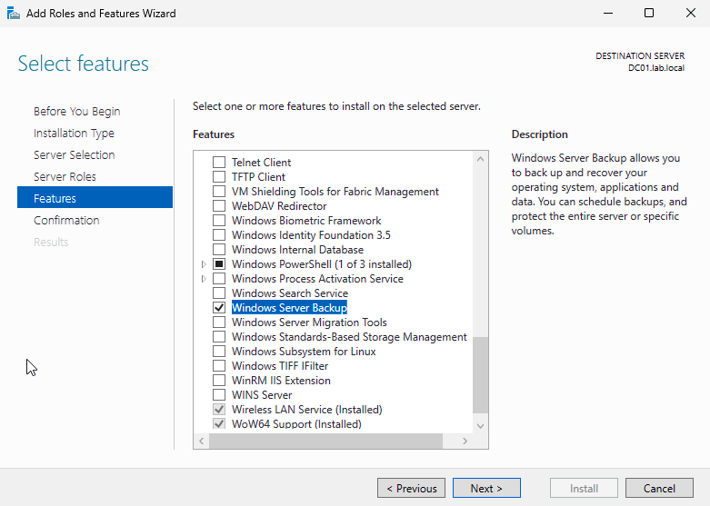
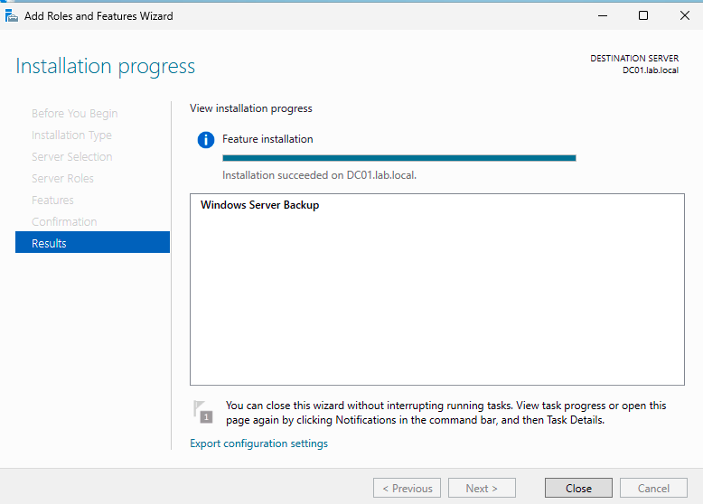

### Full Backup
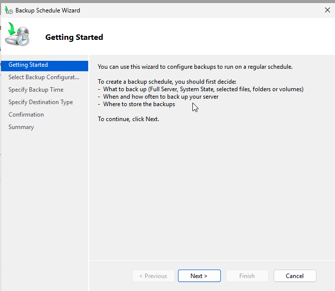
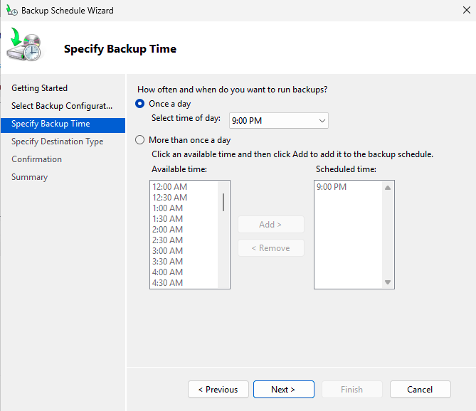
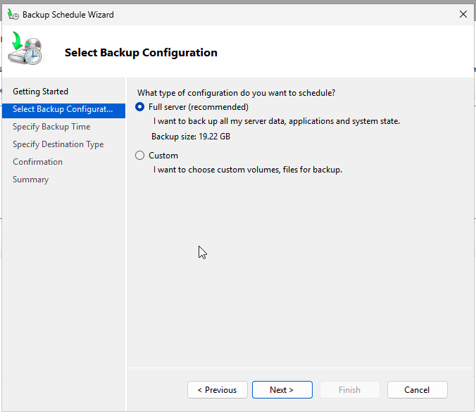
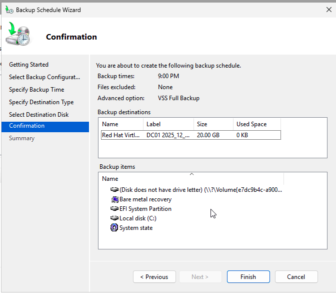
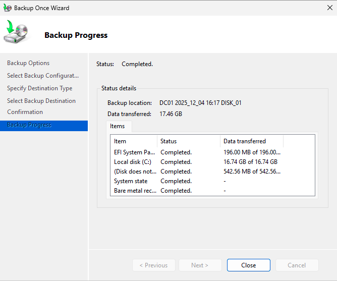

### Test Data Creation
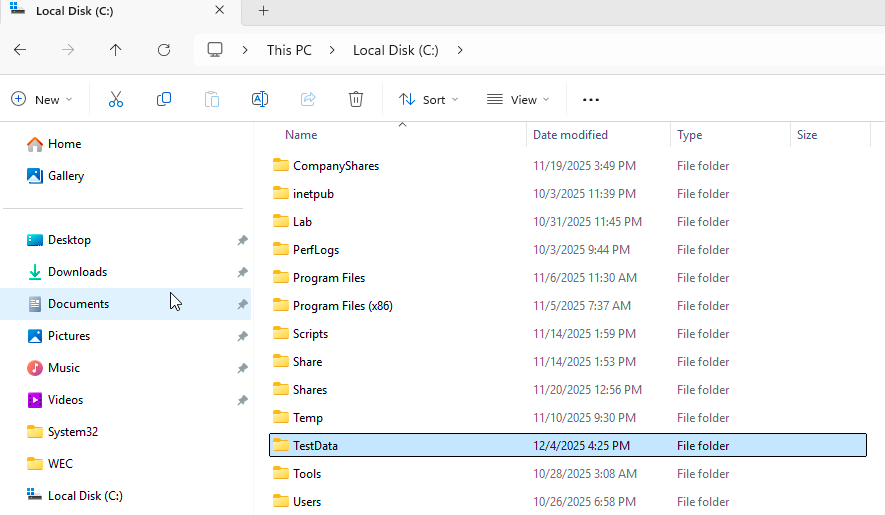
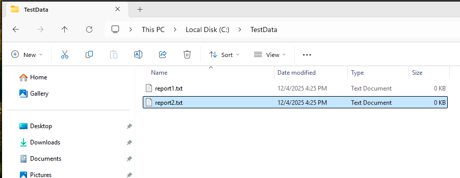

### Incremental Backup
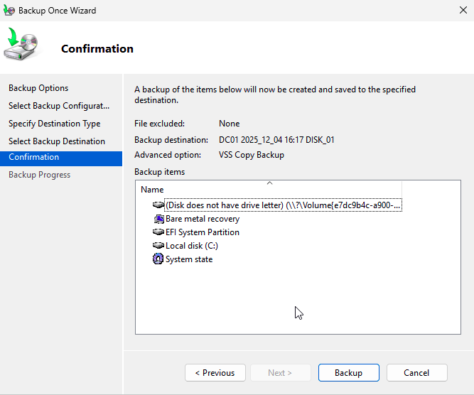

### Simulated Data Loss
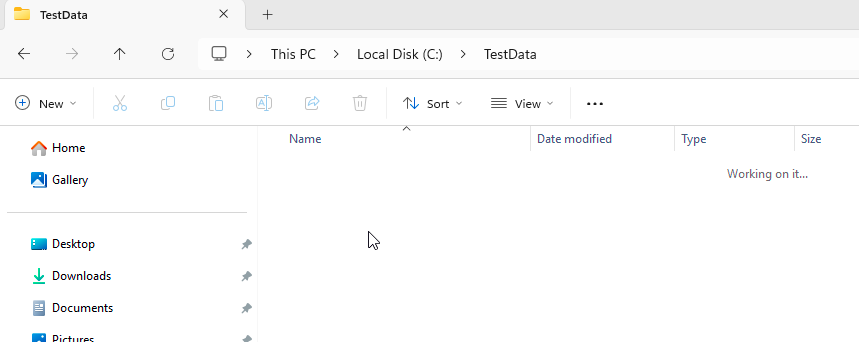
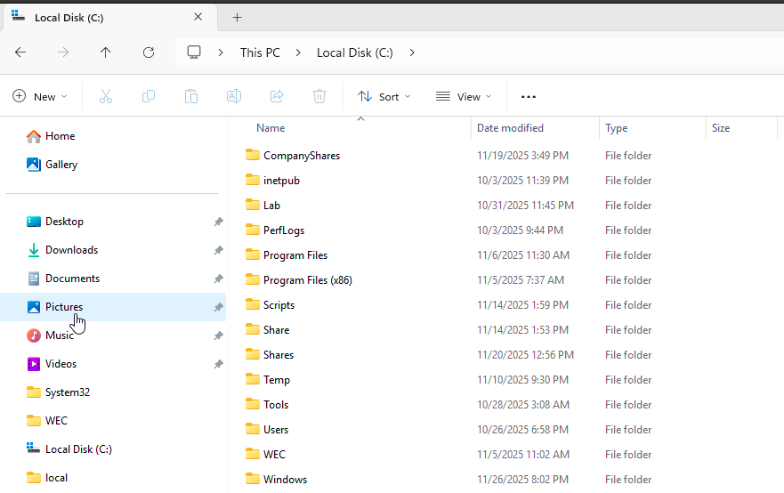

### Recovery
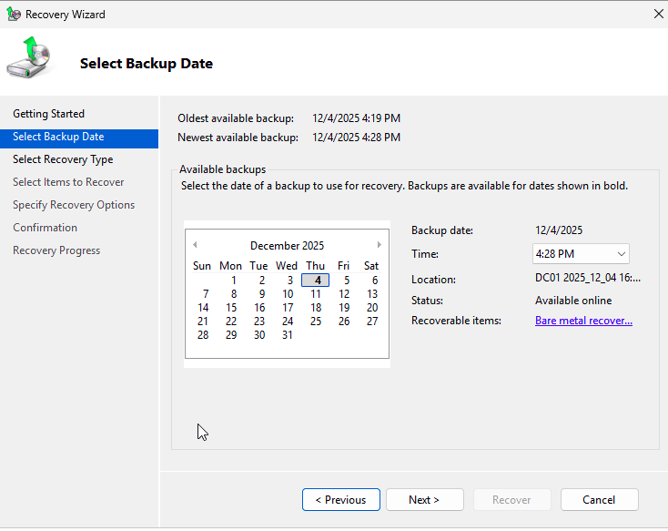
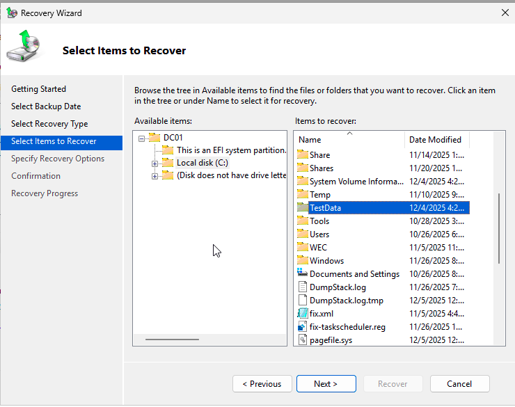
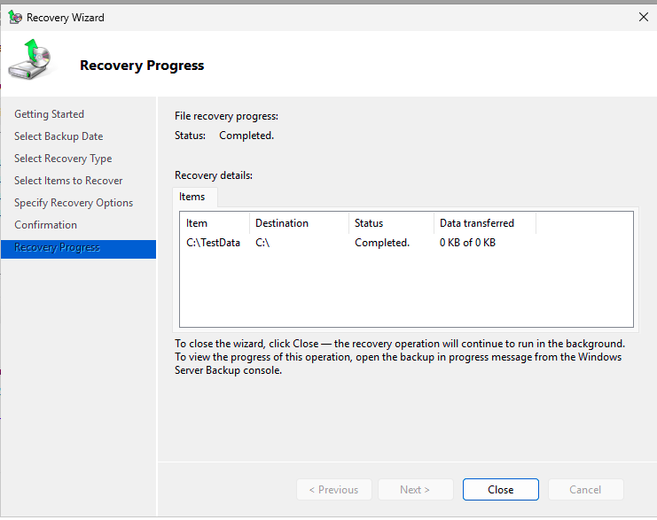

---

## 🛠️ Part 1 — Install Windows Server Backup
1. Open **Server Manager → Add Roles and Features**
2. Under **Features**, enable:
   - ✔ Windows Server Backup  
3. Complete installation  

---

## 💽 Part 2 — Add a Backup Disk (20 GB)
1. Shut down the VM  
2. Add a new **VirtIO** disk (20 GB)  
3. Boot and open **Disk Management**  
4. Bring disk **Online**  
5. Leave as **Unallocated** (Windows Backup will format it)

---

## 🔄 Part 3 — Run a Full Backup
1. Open **Windows Server Backup**
2. Select **Backup Once…**
3. Choose **Full Server**
4. Select the 20 GB disk
5. Choose **VSS Copy Backup**
6. Start the backup

---

## 📁 Part 4 — Create Test Data
1. Create **C:\TestData**
2. Add:
   - `report1.txt`
   - `report2.txt`

---

## 🔄 Part 5 — Run an Incremental Backup
1. Select **Backup Once…**
2. Choose **Full Server**
3. Use same backup disk
4. Run incremental backup

---

## 🗑️ Part 6 — Simulate Data Loss
1. Delete the **TestData** folder  
2. Confirm it is missing in File Explorer  

---

## 🔁 Part 7 — Recover Deleted Files
1. Open **Windows Server Backup**
2. Select **Recover…**
3. Choose **This Server**
4. Select a restore point
5. Choose **Files and Folders**
6. Recover **TestData** to original location
7. Complete the wizard

---

## ✅ Part 8 — Verification
Verify:
- **C:\TestData** exists
- `report1.txt` and `report2.txt` restored successfully

---

## 🧠 What I Learned
- Differences between **full** and **incremental** backups  
- How VSS snapshots work  
- How to configure backup disks  
- How to use Windows Server **Recovery Wizard**  
- Steps to validate backup integrity  

---

## 📘 Tools & Technologies
- Windows Server 2022  
- Windows Server Backup  
- VSS (Volume Shadow Copy Service)  
- VirtIO storage  
- Disk Management  
